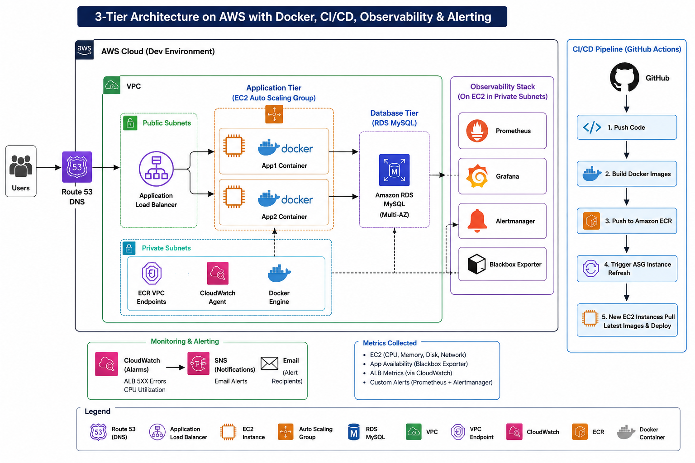

# AWS 3-Tier Web Application on AWS with Docker, Terraform, CI/CD & Observability

<p align="center">
  
</p>

<p align="center">


</p>

> **Production-style AWS 3-tier web application** built with Terraform, Docker, GitHub Actions, Amazon ECR, Auto Scaling, Prometheus, Grafana, Alertmanager, and Blackbox Exporter.

---

# Project Overview

This project demonstrates the design and implementation of a highly available, secure, scalable, and observable AWS infrastructure using Infrastructure as Code (Terraform) and modern DevOps practices.

The infrastructure provisions a complete three-tier architecture, automates Docker deployments through GitHub Actions, and implements an enterprise-grade monitoring stack for infrastructure and application health.

---

# Architecture

The solution consists of four major layers:

## Infrastructure

* Amazon VPC
* Public & Private Subnets
* Route Tables
* Internet Gateway
* NAT Gateway
* Security Groups

## Traffic Management

* Amazon Route 53
* AWS Certificate Manager (HTTPS)
* AWS WAF
* Application Load Balancer
* Host-Based Routing

```
app1.mbodou.org
            │
            ▼
       Target Group 1
            │
      App1 Auto Scaling Group

app2.mbodou.org
            │
            ▼
       Target Group 2
            │
      App2 Auto Scaling Group
```

## Compute

* Docker Containers
* Amazon EC2
* Launch Templates
* Auto Scaling Groups
* Rolling Instance Refresh

## Database

* Amazon RDS MySQL
* Multi-AZ Deployment
* Private Subnets

---

# CI/CD Pipeline

The deployment process is fully automated.

Developer Push

↓

GitHub Repository

↓

GitHub Actions

↓

OIDC Authentication

↓

Docker Build

↓

Amazon ECR

↓

Auto Scaling Group Instance Refresh

↓

New EC2 Instances

↓

Pull Latest Docker Image

↓

Application Healthy

---

# Observability

A dedicated monitoring instance provides centralized monitoring.

Components:

* Prometheus
* Grafana
* Alertmanager
* Blackbox Exporter

Metrics collected using:

* Node Exporter
* EC2 Service Discovery
* HTTP Blackbox Monitoring

---

# Monitoring

Infrastructure Metrics

* CPU Utilization
* Memory Utilization
* Disk Usage
* Network Traffic

Application Metrics

* HTTP Availability
* Target Health
* Response Status

AWS Metrics

* Application Load Balancer
* CloudWatch Alarms

---

# Alerting

Email alerts are automatically generated for:

* High CPU
* High Disk Usage
* Instance Down
* Application Down
* ALB 5XX Errors

---

# Security

* IAM Roles
* GitHub OIDC Authentication
* AWS WAF
* HTTPS with ACM
* Least Privilege Access
* Security Groups
* Private Database
* No Long-Term AWS Credentials

---

# High Availability

* Multi-AZ Application Load Balancer
* Multi-AZ Auto Scaling Groups
* Multi-AZ Amazon RDS
* Health Checks
* Automatic Instance Replacement

---

# Repository Structure

```text
.
├── .github/
│   └── workflows/
│       ├── terraform-dev.yml
│       ├── terraform-prod.yml
│       └── deploy-apps.yml
│
├── apps/
│   ├── app1/
│   └── app2/
│
├── environments/
│   ├── dev/
│   └── prod/
│
├── modules/
│   ├── alb/
│   ├── app/
│   ├── ecr/
│   ├── iam/
│   ├── observability/
│   ├── rds/
│   ├── route53/
│   ├── security-groups/
│   ├── vpc/
│   └── waf/
│
└── docs/
    └── images/
        └── aws-3tier-architecture.png
```

---

# Technologies

### AWS

* Amazon EC2
* Amazon VPC
* Application Load Balancer
* Auto Scaling
* Amazon RDS MySQL
* Amazon Route 53
* AWS Certificate Manager
* AWS WAF
* Amazon ECR
* Amazon S3
* Amazon DynamoDB
* Amazon CloudWatch
* AWS Systems Manager
* IAM

### DevOps

* Terraform
* Docker
* GitHub Actions
* OpenID Connect (OIDC)
* Infrastructure as Code

### Monitoring

* Prometheus
* Grafana
* Alertmanager
* Blackbox Exporter
* Node Exporter

---

# Validation

The infrastructure was validated by performing:

* Docker deployment
* Rolling deployments
* Auto Scaling validation
* ALB health checks
* Host-based routing validation
* Prometheus target discovery
* Grafana dashboard validation
* CPU stress testing
* Disk usage testing
* Instance failure simulation
* Application availability monitoring
* Alertmanager email notifications
* CloudWatch alarm validation

---

# Skills Demonstrated

* AWS Cloud Architecture
* Infrastructure as Code (Terraform)
* Docker Containerization
* GitHub Actions CI/CD
* Amazon ECR
* Auto Scaling
* High Availability
* Monitoring & Observability
* Linux Administration
* Networking
* Cloud Security
* Automation

---

# Author

**Mahamat Mbodou**

AWS Certified Solutions Architect – Associate

Cloud Engineer | DevOps Engineer

⭐ If you found this project useful, consider starring the repository.


<!-- # Production-Style AWS 3-Tier Architecture with Terraform & CI/CD

## Project Overview

This project demonstrates a production-style AWS 3-tier architecture built using Terraform and GitHub Actions CI/CD.

The infrastructure follows Infrastructure as Code best practices with modular Terraform design, environment separation, automated deployments, monitoring, and secure networking.

---

# Architecture Features

- Modular Terraform architecture
- Dev and Prod environments
- Remote Terraform state using S3 + DynamoDB
- GitHub Actions CI/CD pipelines
- OIDC authentication for secure AWS access
- HTTPS using ACM + Route 53
- Application Load Balancer with host-based routing
- Auto Scaling Groups with Launch Templates
- AWS Systems Manager Session Manager access
- CloudWatch monitoring and alarms
- SNS alert notifications
- AWS WAF protection
- Automated S3 artifact deployments

---

# Architecture Diagram


# High-Level Architecture

```text
User
  ↓
Route 53 DNS
  ↓
Application Load Balancer HTTPS via ACM
  ↓
AWS WAF
  ↓
Target Groups
  ↓
Auto Scaling Groups
  ↓
Private EC2 Instances
```

---

# 3-Tier Architecture Design

## Public Tier

Contains internet-facing resources.

### Components
- Application Load Balancer
- Internet Gateway
- Public Subnets

---

## Private Application Tier

Contains application servers.

### Components
- EC2 Instances
- Auto Scaling Groups
- Launch Templates
- Security Groups
- Systems Manager Session Manager

---

## Database Tier

Contains isolated database networking resources.

### Components
- Database Subnets
- RDS-ready subnet groups
- Restricted Security Groups

---

# Host-Based Routing

The ALB uses host-based routing.

```text
app1.mbodou.org → App1 Target Group
app2.mbodou.org → App2 Target Group
mbodou.org      → Default Rule
```

---

# Terraform Modular Structure

## Modules

```text
modules/
├── acm
├── alb
├── app
├── iam
├── monitoring
├── rds
├── route53-dns
├── security-groups
├── vpc
└── WAF
```

---

## Environments

```text
environments/
├── dev
└── prod
```

---

# Remote Terraform State

Terraform state is stored remotely using:

- Amazon S3 backend
- DynamoDB state locking

```text
Terraform
  ↓
S3 Backend
  ↓
DynamoDB Lock Table
```

### Benefits

- Centralized state management
- Team collaboration
- State locking protection
- Safe CI/CD deployments

---

# CI/CD Infrastructure Pipeline

## Development Pipeline

```text
Code Change
  ↓
GitHub Push
  ↓
GitHub Actions
  ↓
Terraform fmt
  ↓
Terraform validate
  ↓
Terraform plan/apply
  ↓
AWS Infrastructure Updated
```

---

## Production Pipeline

```text
Manual Workflow Trigger
  ↓
GitHub Environment Approval
  ↓
Terraform plan/apply
  ↓
Production Infrastructure Updated
```

---

# Application Deployment Pipeline

```text
App Code Change
  ↓
GitHub Actions
  ↓
Build ZIP Artifact
  ↓
Upload to S3
  ↓
Auto Scaling Instance Refresh
  ↓
New EC2 Instances Deploy Application
```

---

# Artifact Deployment

Artifacts are stored inside Amazon S3.

```text
s3://artifact-bucket/
├── app1/app1.zip
└── app2/app2.zip
```

During EC2 bootstrap:

```text
EC2 User Data
  ↓
Download ZIP from S3
  ↓
Extract to /var/www/html
  ↓
Start Apache
  ↓
ALB Health Check Passes
```

---

# Monitoring & Alerting

CloudWatch is used for monitoring and alerting.

### Monitoring Includes

- ALB Metrics
- Auto Scaling Metrics
- Target Group Health
- EC2 Metrics
- WAF Metrics

### Alerting Flow

```text
CloudWatch Alarm
  ↓
SNS Notification
  ↓
Email Alert
```

---

# Security Features

- Private EC2 Instances
- No public SSH access
- AWS Systems Manager Session Manager
- Security Groups
- IAM Roles
- GitHub Actions OIDC Authentication
- HTTPS using ACM
- AWS WAF Protection
- Terraform State Locking

---

# AWS Services Used

- VPC
- EC2
- Auto Scaling Groups
- Launch Templates
- Application Load Balancer
- Route 53
- ACM
- IAM
- S3
- DynamoDB
- Systems Manager
- CloudWatch
- SNS
- AWS WAF
- RDS

---

# Challenges Solved

During this project, several real-world engineering issues were solved:

- Terraform backend configuration issues
- S3 state checksum mismatch
- DynamoDB locking errors
- IAM OIDC trust policy troubleshooting
- ALB health check failures
- GitHub Actions YAML issues
- Auto Scaling instance refresh conflicts
- S3 artifact deployment troubleshooting
- Dev/prod naming conflicts

---

# Demo Video

```text
https://youtu.be/a3lh6fcN9O8
```

---

# Final Outcome

This project demonstrates hands-on experience with:

- AWS Cloud Infrastructure
- Infrastructure as Code
- Terraform Modular Design
- Remote State Management
- CI/CD Automation
- Monitoring & Alerting
- Auto Scaling & Self-Healing
- Secure Cloud Networking
- Production-Style AWS Architecture -->
